# Sifo Architecture Diagrams

This document provides visual representations of the Sifo iOS application architecture using Mermaid diagrams.

## Table of Contents

1. [System Overview](#system-overview)
2. [Clean Architecture Layers](#clean-architecture-layers)
3. [Package Dependencies](#package-dependencies)
4. [Data Flow Sequences](#data-flow-sequences)
5. [State Management](#state-management)
6. [Navigation Flow](#navigation-flow)

---

## System Overview

### High-Level Architecture

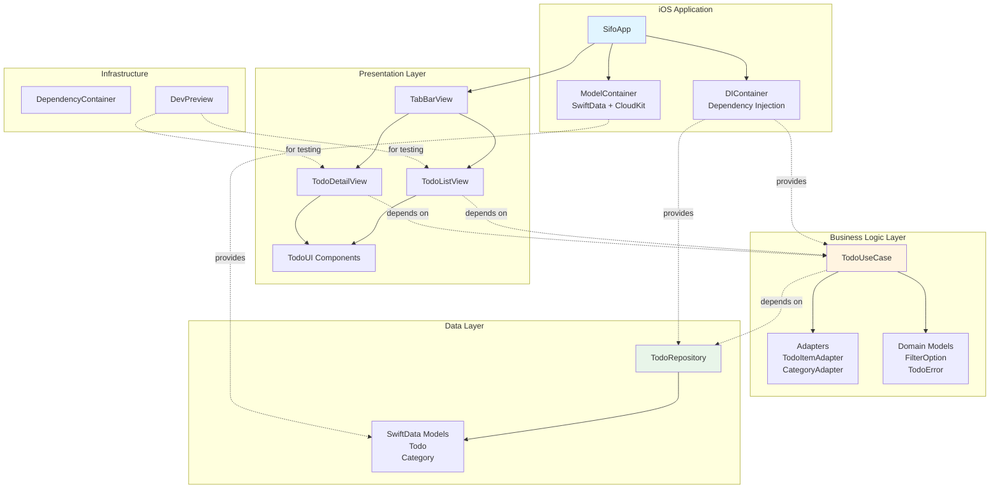
```mermaid
graph TB
    subgraph "iOS Application"
        App[SifoApp]
        Container[ModelContainer<br/>SwiftData + CloudKit]
        DI[DIContainer<br/>Dependency Injection]
    end

    subgraph "Presentation Layer"
        TabBar[TabBarView]
        TodoList[TodoListView]
        TodoDetail[TodoDetailView]
        UI[TodoUI Components]
    end

    subgraph "Business Logic Layer"
        UseCase[TodoUseCase]
        Adapters[Adapters<br/>TodoItemAdapter<br/>CategoryAdapter]
        Domain[Domain Models<br/>FilterOption<br/>TodoError]
    end

    subgraph "Data Layer"
        Repo[TodoRepository]
        Models[SwiftData Models<br/>Todo<br/>Category]
    end

    subgraph "Infrastructure"
        DILib[DependencyContainer]
        Preview[DevPreview]
    end

    App --> Container
    App --> DI
    App --> TabBar
    TabBar --> TodoList
    TabBar --> TodoDetail
    TodoList --> UI
    TodoDetail --> UI

    TodoList -.depends on.-> UseCase
    TodoDetail -.depends on.-> UseCase
    UseCase -.depends on.-> Repo
    UseCase --> Adapters
    UseCase --> Domain
    Repo --> Models

    DI -.provides.-> UseCase
    DI -.provides.-> Repo
    Container -.provides.-> Models

    Preview -.for testing.-> TodoList
    Preview -.for testing.-> TodoDetail

    style App fill:#e1f5ff
    style UseCase fill:#fff4e1
    style Repo fill:#e8f5e9
```

---

## Clean Architecture Layers

### Layer Dependencies

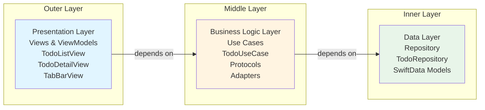
```mermaid
graph LR
    subgraph "Outer Layer"
        Presentation[Presentation Layer<br/>Views & ViewModels<br/>TodoListView<br/>TodoDetailView<br/>TabBarView]
    end

    subgraph "Middle Layer"
        Business[Business Logic Layer<br/>Use Cases<br/>TodoUseCase<br/>Protocols<br/>Adapters]
    end

    subgraph "Inner Layer"
        Data[Data Layer<br/>Repository<br/>TodoRepository<br/>SwiftData Models]
    end

    Presentation -->|depends on| Business
    Business -->|depends on| Data

    style Presentation fill:#e1f5ff
    style Business fill:#fff4e1
    style Data fill:#e8f5e9
```

### Dependency Rule

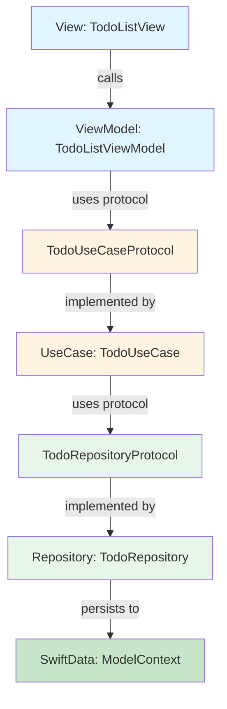
```mermaid
flowchart TD
    A[View: TodoListView] -->|calls| B[ViewModel: TodoListViewModel]
    B -->|uses protocol| C[TodoUseCaseProtocol]
    C -->|implemented by| D[UseCase: TodoUseCase]
    D -->|uses protocol| E[TodoRepositoryProtocol]
    E -->|implemented by| F[Repository: TodoRepository]
    F -->|persists to| G[SwiftData: ModelContext]

    style A fill:#e1f5ff
    style B fill:#e1f5ff
    style C fill:#fff4e1
    style D fill:#fff4e1
    style E fill:#e8f5e9
    style F fill:#e8f5e9
    style G fill:#c8e6c9
```

---

## Package Dependencies

### SPM Package Structure

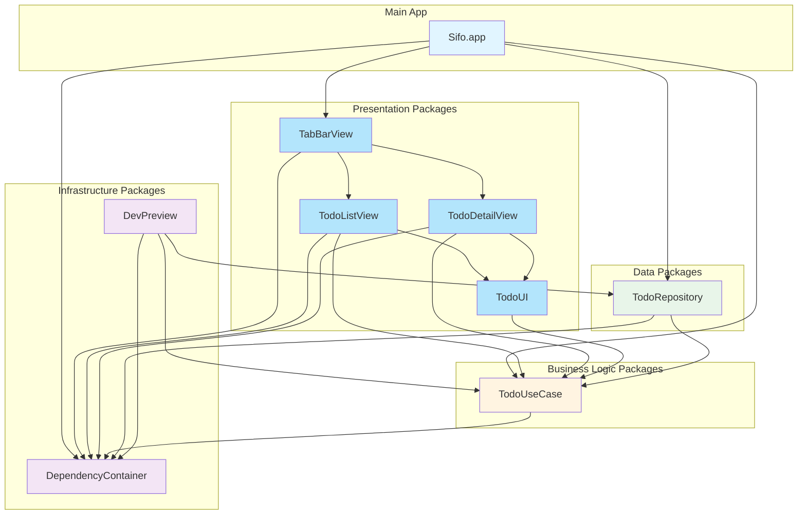
```mermaid
graph TD
    subgraph "Main App"
        SifoApp[Sifo.app]
    end

    subgraph "Presentation Packages"
        TabBar[TabBarView]
        TodoList[TodoListView]
        TodoDetail[TodoDetailView]
        TodoUILib[TodoUI]
    end

    subgraph "Business Logic Packages"
        UseCase[TodoUseCase]
    end

    subgraph "Data Packages"
        Repo[TodoRepository]
    end

    subgraph "Infrastructure Packages"
        DI[DependencyContainer]
        Preview[DevPreview]
    end

    SifoApp --> TabBar
    SifoApp --> DI
    SifoApp --> UseCase
    SifoApp --> Repo

    TabBar --> TodoList
    TabBar --> TodoDetail
    TabBar --> DI

    TodoList --> TodoUILib
    TodoList --> UseCase
    TodoList --> DI

    TodoDetail --> TodoUILib
    TodoDetail --> UseCase
    TodoDetail --> DI

    TodoUILib --> UseCase

    UseCase --> DI

    Repo --> UseCase
    Repo --> DI

    Preview --> DI
    Preview --> UseCase
    Preview --> Repo

    style SifoApp fill:#e1f5ff
    style TabBar fill:#b3e5fc
    style TodoList fill:#b3e5fc
    style TodoDetail fill:#b3e5fc
    style TodoUILib fill:#b3e5fc
    style UseCase fill:#fff4e1
    style Repo fill:#e8f5e9
    style DI fill:#f3e5f5
    style Preview fill:#f3e5f5
```

### Package Import Graph

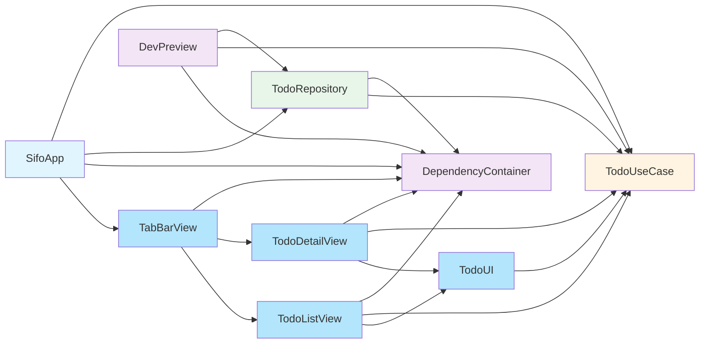
```mermaid
graph LR
    A[SifoApp] --> B[TabBarView]
    A --> C[DependencyContainer]
    A --> D[TodoRepository]
    A --> E[TodoUseCase]

    B --> F[TodoListView]
    B --> G[TodoDetailView]
    B --> C

    F --> H[TodoUI]
    F --> E
    F --> C

    G --> H
    G --> E
    G --> C

    H --> E

    D --> E
    D --> C

    I[DevPreview] --> C
    I --> E
    I --> D

    style A fill:#e1f5ff
    style B fill:#b3e5fc
    style F fill:#b3e5fc
    style G fill:#b3e5fc
    style H fill:#b3e5fc
    style E fill:#fff4e1
    style D fill:#e8f5e9
    style C fill:#f3e5f5
    style I fill:#f3e5f5
```

---

## Data Flow Sequences

### Creating a New Todo

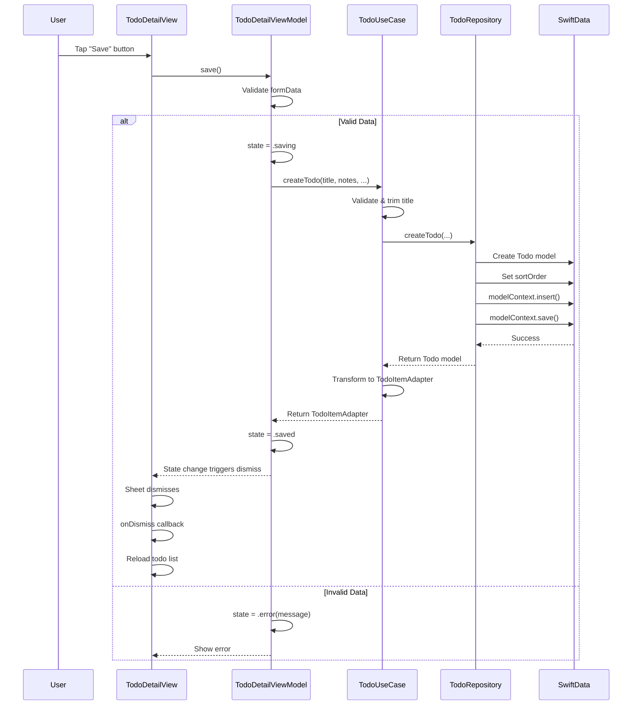
```mermaid
sequenceDiagram
    participant User
    participant View as TodoDetailView
    participant VM as TodoDetailViewModel
    participant UC as TodoUseCase
    participant Repo as TodoRepository
    participant SD as SwiftData

    User->>View: Tap "Save" button
    View->>VM: save()
    VM->>VM: Validate formData

    alt Valid Data
        VM->>VM: state = .saving
        VM->>UC: createTodo(title, notes, ...)
        UC->>UC: Validate & trim title
        UC->>Repo: createTodo(...)
        Repo->>SD: Create Todo model
        Repo->>SD: Set sortOrder
        Repo->>SD: modelContext.insert()
        Repo->>SD: modelContext.save()
        SD-->>Repo: Success
        Repo-->>UC: Return Todo model
        UC->>UC: Transform to TodoItemAdapter
        UC-->>VM: Return TodoItemAdapter
        VM->>VM: state = .saved
        VM-->>View: State change triggers dismiss
        View->>View: Sheet dismisses
        View->>View: onDismiss callback
        View->>View: Reload todo list
    else Invalid Data
        VM->>VM: state = .error(message)
        VM-->>View: Show error
    end
```

### Filtering Todos

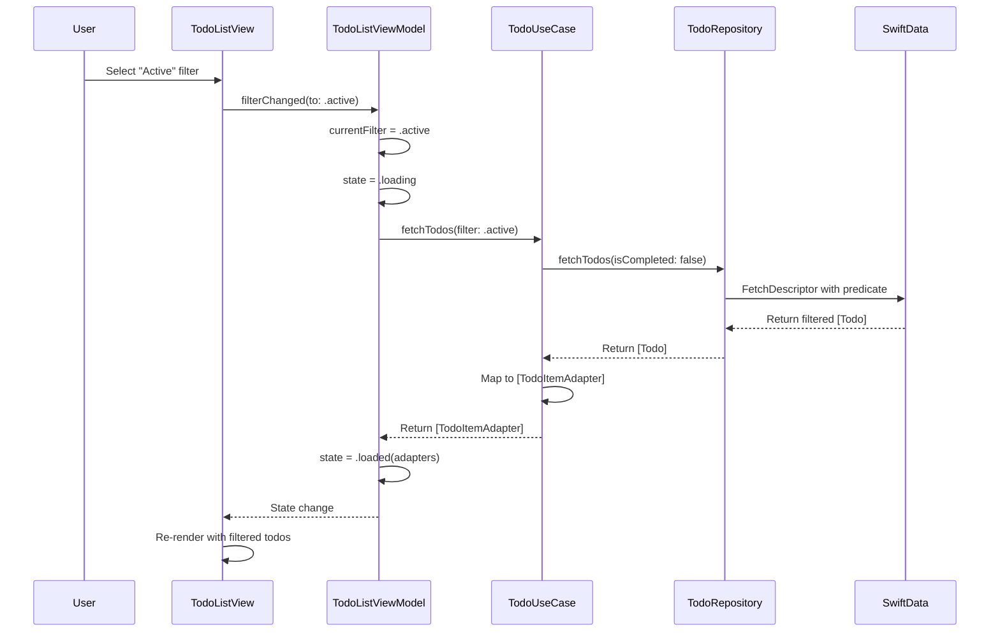
```mermaid
sequenceDiagram
    participant User
    participant View as TodoListView
    participant VM as TodoListViewModel
    participant UC as TodoUseCase
    participant Repo as TodoRepository
    participant SD as SwiftData

    User->>View: Select "Active" filter
    View->>VM: filterChanged(to: .active)
    VM->>VM: currentFilter = .active
    VM->>VM: state = .loading
    VM->>UC: fetchTodos(filter: .active)
    UC->>Repo: fetchTodos(isCompleted: false)
    Repo->>SD: FetchDescriptor with predicate
    SD-->>Repo: Return filtered [Todo]
    Repo-->>UC: Return [Todo]
    UC->>UC: Map to [TodoItemAdapter]
    UC-->>VM: Return [TodoItemAdapter]
    VM->>VM: state = .loaded(adapters)
    VM-->>View: State change
    View->>View: Re-render with filtered todos
```

### Deleting a Todo with Confirmation

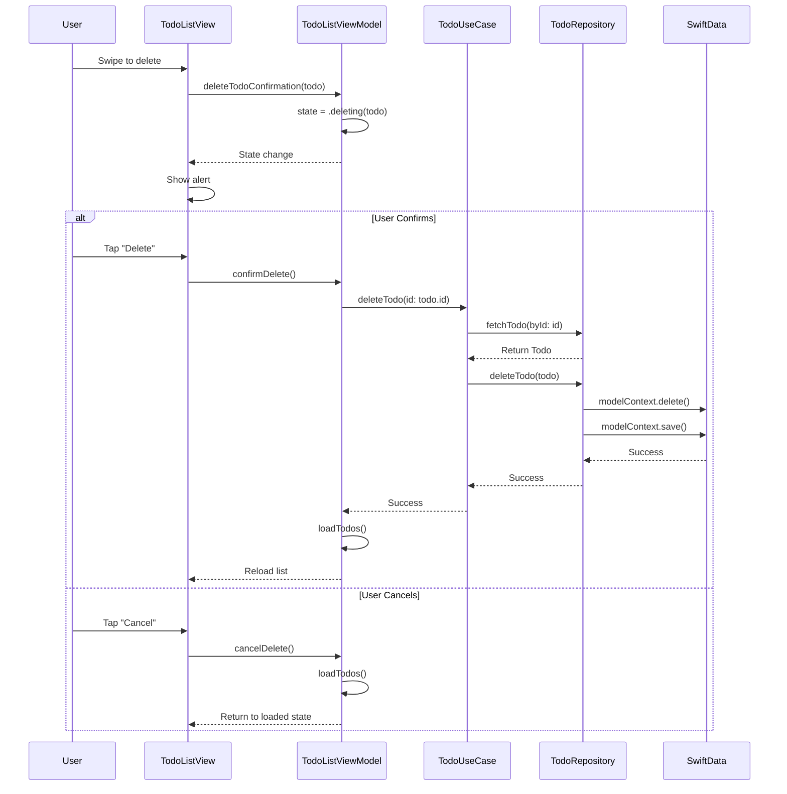
```mermaid
sequenceDiagram
    participant User
    participant View as TodoListView
    participant VM as TodoListViewModel
    participant UC as TodoUseCase
    participant Repo as TodoRepository
    participant SD as SwiftData

    User->>View: Swipe to delete
    View->>VM: deleteTodoConfirmation(todo)
    VM->>VM: state = .deleting(todo)
    VM-->>View: State change
    View->>View: Show alert

    alt User Confirms
        User->>View: Tap "Delete"
        View->>VM: confirmDelete()
        VM->>UC: deleteTodo(id: todo.id)
        UC->>Repo: fetchTodo(byId: id)
        Repo-->>UC: Return Todo
        UC->>Repo: deleteTodo(todo)
        Repo->>SD: modelContext.delete()
        Repo->>SD: modelContext.save()
        SD-->>Repo: Success
        Repo-->>UC: Success
        UC-->>VM: Success
        VM->>VM: loadTodos()
        VM-->>View: Reload list
    else User Cancels
        User->>View: Tap "Cancel"
        View->>VM: cancelDelete()
        VM->>VM: loadTodos()
        VM-->>View: Return to loaded state
    end
```

### Toggle Todo Completion

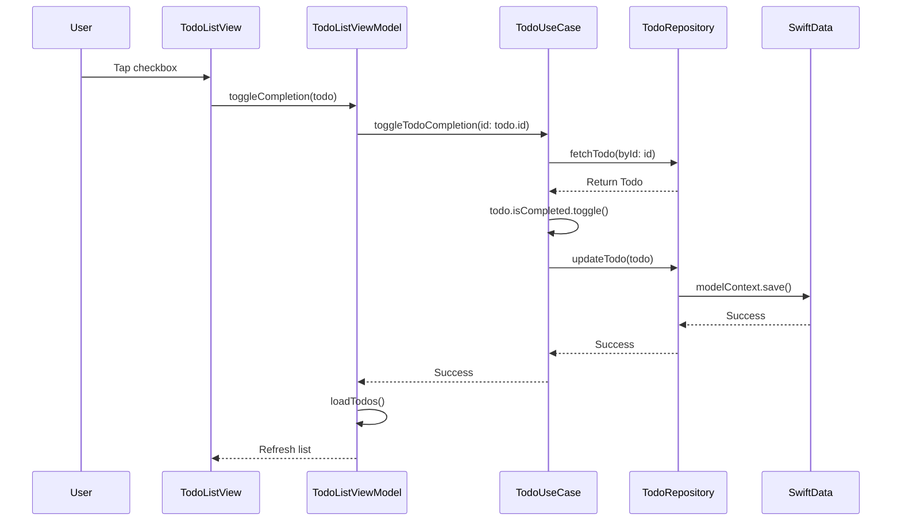
```mermaid
sequenceDiagram
    participant User
    participant View as TodoListView
    participant VM as TodoListViewModel
    participant UC as TodoUseCase
    participant Repo as TodoRepository
    participant SD as SwiftData

    User->>View: Tap checkbox
    View->>VM: toggleCompletion(todo)
    VM->>UC: toggleTodoCompletion(id: todo.id)
    UC->>Repo: fetchTodo(byId: id)
    Repo-->>UC: Return Todo
    UC->>UC: todo.isCompleted.toggle()
    UC->>Repo: updateTodo(todo)
    Repo->>SD: modelContext.save()
    SD-->>Repo: Success
    Repo-->>UC: Success
    UC-->>VM: Success
    VM->>VM: loadTodos()
    VM-->>View: Refresh list
```

---

## State Management

### TodoListViewModel State Machine

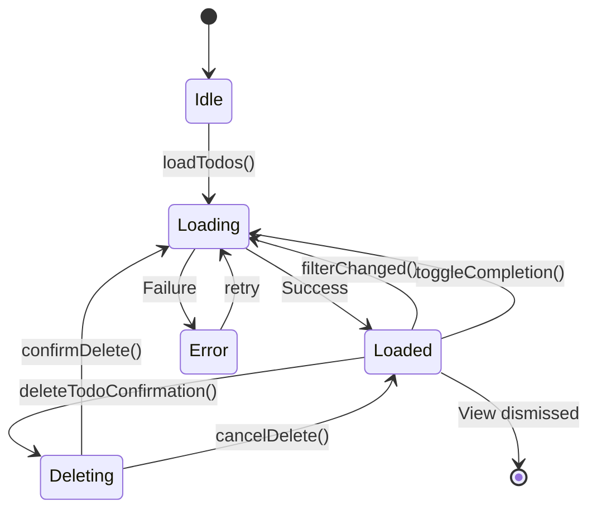
```mermaid
stateDiagram-v2
    [*] --> Idle
    Idle --> Loading: loadTodos()
    Loading --> Loaded: Success
    Loading --> Error: Failure
    Loaded --> Loading: filterChanged()
    Loaded --> Deleting: deleteTodoConfirmation()
    Loaded --> Loading: toggleCompletion()
    Deleting --> Loading: confirmDelete()
    Deleting --> Loaded: cancelDelete()
    Error --> Loading: retry
    Loaded --> [*]: View dismissed
```

### TodoDetailViewModel State Machine

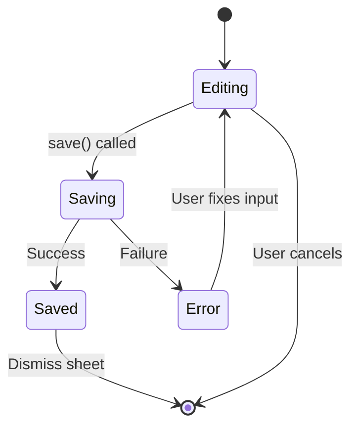
```mermaid
stateDiagram-v2
    [*] --> Editing
    Editing --> Saving: save() called
    Saving --> Saved: Success
    Saving --> Error: Failure
    Error --> Editing: User fixes input
    Saved --> [*]: Dismiss sheet
    Editing --> [*]: User cancels
```

### State Transitions Example

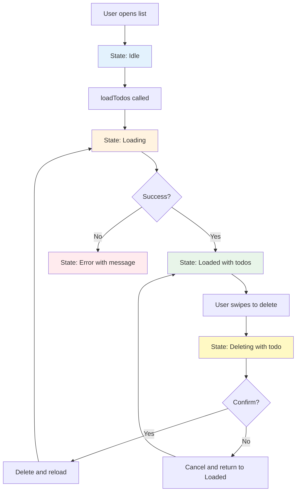
```mermaid
flowchart TD
    A[User opens list] --> B[State: Idle]
    B --> C[loadTodos called]
    C --> D[State: Loading]
    D --> E{Success?}
    E -->|Yes| F[State: Loaded with todos]
    E -->|No| G[State: Error with message]

    F --> H[User swipes to delete]
    H --> I[State: Deleting with todo]
    I --> J{Confirm?}
    J -->|Yes| K[Delete and reload]
    J -->|No| L[Cancel and return to Loaded]

    K --> D
    L --> F

    style B fill:#e3f2fd
    style D fill:#fff3e0
    style F fill:#e8f5e9
    style G fill:#ffebee
    style I fill:#fff9c4
```

---

## Navigation Flow

### Tab-Based Navigation with Sheets

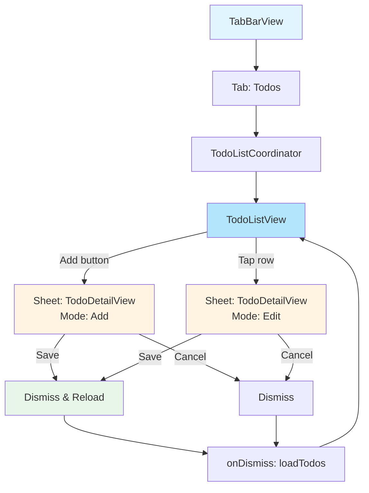
```mermaid
graph TD
    A[TabBarView] --> B[Tab: Todos]
    B --> C[TodoListCoordinator]
    C --> D[TodoListView]

    D -->|Add button| E[Sheet: TodoDetailView<br/>Mode: Add]
    D -->|Tap row| F[Sheet: TodoDetailView<br/>Mode: Edit]

    E -->|Save| G[Dismiss & Reload]
    E -->|Cancel| H[Dismiss]

    F -->|Save| G
    F -->|Cancel| H

    G --> I[onDismiss: loadTodos]
    H --> I
    I --> D

    style A fill:#e1f5ff
    style D fill:#b3e5fc
    style E fill:#fff4e1
    style F fill:#fff4e1
    style G fill:#e8f5e9
```

### Router Protocol Pattern

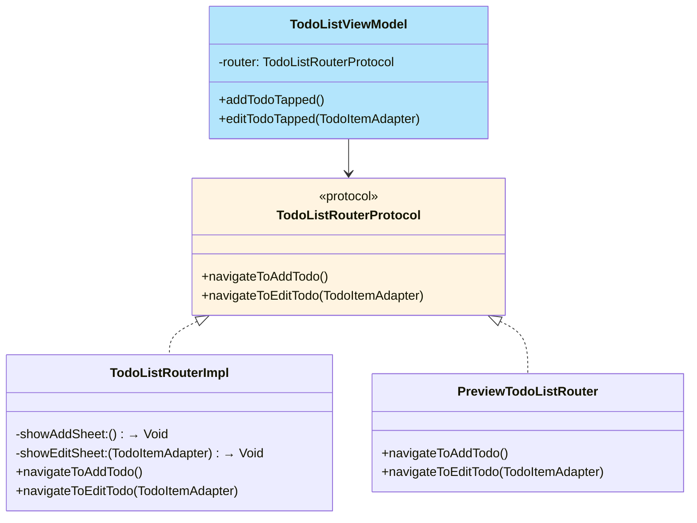
```mermaid
classDiagram
    class TodoListRouterProtocol {
        <<protocol>>
        +navigateToAddTodo()
        +navigateToEditTodo(TodoItemAdapter)
    }

    class TodoListRouterImpl {
        -showAddSheet: () → Void
        -showEditSheet: (TodoItemAdapter) → Void
        +navigateToAddTodo()
        +navigateToEditTodo(TodoItemAdapter)
    }

    class PreviewTodoListRouter {
        +navigateToAddTodo()
        +navigateToEditTodo(TodoItemAdapter)
    }

    class TodoListViewModel {
        -router: TodoListRouterProtocol
        +addTodoTapped()
        +editTodoTapped(TodoItemAdapter)
    }

    TodoListRouterProtocol <|.. TodoListRouterImpl
    TodoListRouterProtocol <|.. PreviewTodoListRouter
    TodoListViewModel --> TodoListRouterProtocol

    style TodoListRouterProtocol fill:#fff4e1
    style TodoListViewModel fill:#b3e5fc
```

### Sheet Presentation Flow

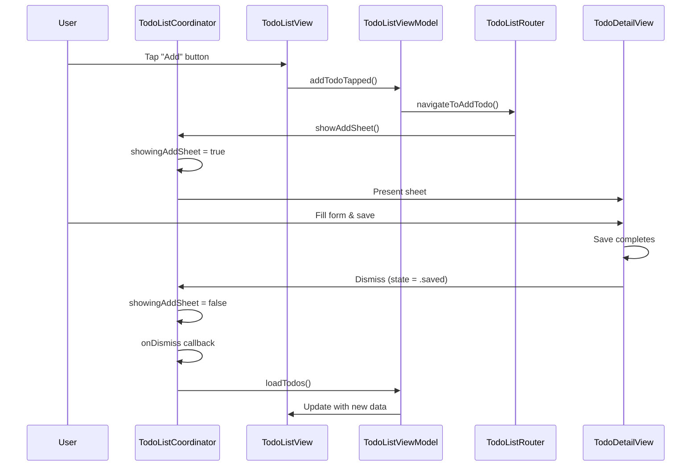
```mermaid
sequenceDiagram
    participant User
    participant Coordinator as TodoListCoordinator
    participant List as TodoListView
    participant VM as TodoListViewModel
    participant Router as TodoListRouter
    participant Detail as TodoDetailView

    User->>List: Tap "Add" button
    List->>VM: addTodoTapped()
    VM->>Router: navigateToAddTodo()
    Router->>Coordinator: showAddSheet()
    Coordinator->>Coordinator: showingAddSheet = true
    Coordinator->>Detail: Present sheet

    User->>Detail: Fill form & save
    Detail->>Detail: Save completes
    Detail->>Coordinator: Dismiss (state = .saved)
    Coordinator->>Coordinator: showingAddSheet = false
    Coordinator->>Coordinator: onDismiss callback
    Coordinator->>VM: loadTodos()
    VM->>List: Update with new data
```

---

## Builder Pattern

### Feature Composition Flow

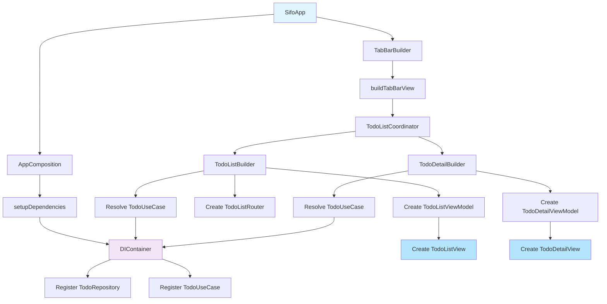
```mermaid
graph TD
    A[SifoApp] --> B[AppComposition]
    B --> C[setupDependencies]
    C --> D[DIContainer]

    D --> E[Register TodoRepository]
    D --> F[Register TodoUseCase]

    A --> G[TabBarBuilder]
    G --> H[buildTabBarView]
    H --> I[TodoListCoordinator]

    I --> J[TodoListBuilder]
    J --> K[Resolve TodoUseCase]
    K --> D
    J --> L[Create TodoListRouter]
    J --> M[Create TodoListViewModel]
    M --> N[Create TodoListView]

    I --> O[TodoDetailBuilder]
    O --> P[Resolve TodoUseCase]
    P --> D
    O --> Q[Create TodoDetailViewModel]
    Q --> R[Create TodoDetailView]

    style A fill:#e1f5ff
    style D fill:#f3e5f5
    style N fill:#b3e5fc
    style R fill:#b3e5fc
```

### Builder Class Hierarchy

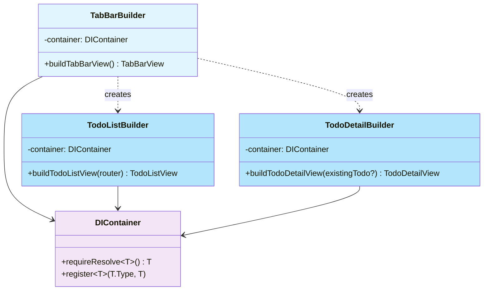
```mermaid
classDiagram
    class TabBarBuilder {
        -container: DIContainer
        +buildTabBarView() TabBarView
    }

    class TodoListBuilder {
        -container: DIContainer
        +buildTodoListView(router) TodoListView
    }

    class TodoDetailBuilder {
        -container: DIContainer
        +buildTodoDetailView(existingTodo?) TodoDetailView
    }

    class DIContainer {
        +requireResolve~T~() T
        +register~T~(T.Type, T)
    }

    TabBarBuilder --> DIContainer
    TodoListBuilder --> DIContainer
    TodoDetailBuilder --> DIContainer

    TabBarBuilder ..> TodoListBuilder: creates
    TabBarBuilder ..> TodoDetailBuilder: creates

    style DIContainer fill:#f3e5f5
    style TabBarBuilder fill:#e1f5ff
    style TodoListBuilder fill:#b3e5fc
    style TodoDetailBuilder fill:#b3e5fc
```

---

## SwiftData & CloudKit Integration

### Data Persistence Flow

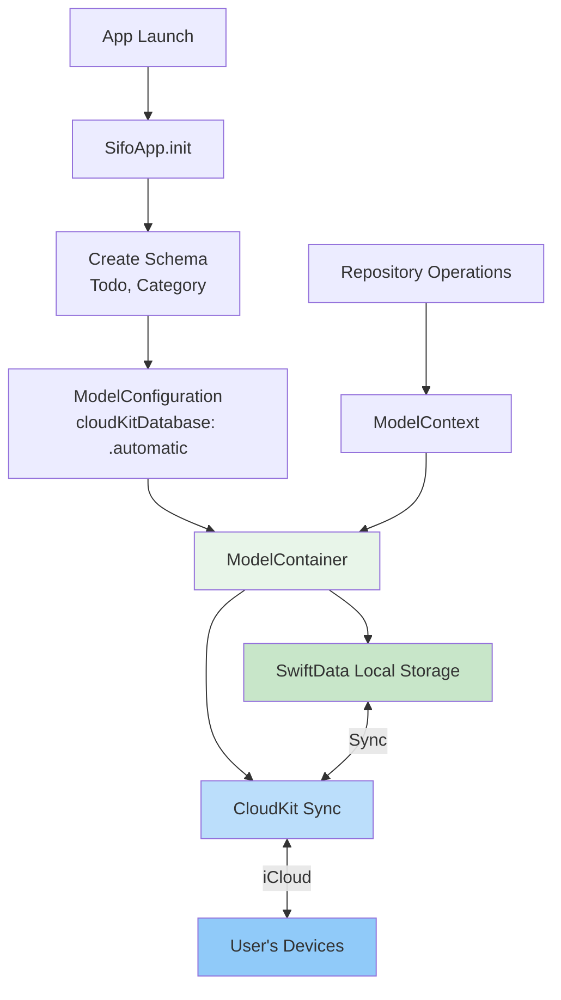
```mermaid
graph TD
    A[App Launch] --> B[SifoApp.init]
    B --> C[Create Schema<br/>Todo, Category]
    C --> D[ModelConfiguration<br/>cloudKitDatabase: .automatic]
    D --> E[ModelContainer]
    E --> F[SwiftData Local Storage]
    E --> G[CloudKit Sync]

    H[Repository Operations] --> I[ModelContext]
    I --> E

    F <-->|Sync| G
    G <-->|iCloud| J[User's Devices]

    style E fill:#e8f5e9
    style F fill:#c8e6c9
    style G fill:#bbdefb
    style J fill:#90caf9
```

### Model Relationships

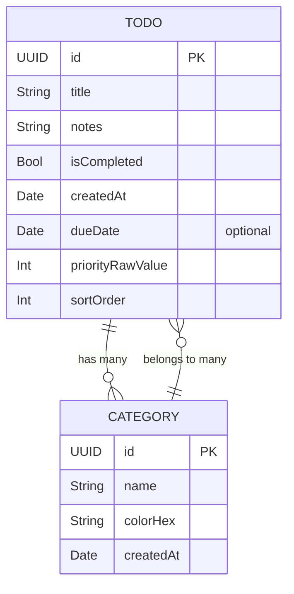
```mermaid
erDiagram
    TODO ||--o{ CATEGORY : "has many"
    CATEGORY ||--o{ TODO : "belongs to many"

    TODO {
        UUID id PK
        String title
        String notes
        Bool isCompleted
        Date createdAt
        Date dueDate "optional"
        Int priorityRawValue
        Int sortOrder
    }

    CATEGORY {
        UUID id PK
        String name
        String colorHex
        Date createdAt
    }
```

---

## Adapter Pattern

### DTO Transformation

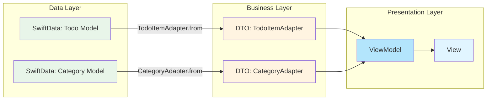
```mermaid
graph LR
    A[SwiftData: Todo Model] -->|TodoItemAdapter.from| B[DTO: TodoItemAdapter]
    C[SwiftData: Category Model] -->|CategoryAdapter.from| D[DTO: CategoryAdapter]

    B --> E[ViewModel]
    D --> E

    E --> F[View]

    subgraph "Data Layer"
        A
        C
    end

    subgraph "Business Layer"
        B
        D
    end

    subgraph "Presentation Layer"
        E
        F
    end

    style A fill:#e8f5e9
    style C fill:#e8f5e9
    style B fill:#fff4e1
    style D fill:#fff4e1
    style E fill:#b3e5fc
    style F fill:#e1f5ff
```

### TodoItemAdapter Structure

```mermaid
classDiagram
    class Todo {
        <<@Model>>
        +title: String
        +notes: String
        +isCompleted: Bool
        +dueDate: Date?
        +priority: TodoPriority
        +categories: [Category]?
        +sortOrder: Int
    }

    class TodoItemAdapter {
        <<Sendable, Identifiable>>
        +id: PersistentIdentifier
        +title: String
        +notes: String
        +isCompleted: Bool
        +dueDate: Date?
        +priority: TodoPriority
        +categories: [CategoryAdapter]
        +sortOrder: Int
        +isDueToday: Bool
        +isOverdue: Bool
        +dueDateFormatted: String
        +from(Todo) TodoItemAdapter$
    }

    Todo ..> TodoItemAdapter : transforms to

    style Todo fill:#e8f5e9
    style TodoItemAdapter fill:#fff4e1
```

---

## Testing Architecture

### Test Doubles Strategy

```mermaid
graph TD
    subgraph "Production Code"
        A[TodoListViewModel]
        B[TodoUseCaseProtocol]
        C[TodoRepositoryProtocol]
    end

    subgraph "Test Code"
        D[TodoListViewModelTests]
        E[FakeTodoUseCase]
        F[FakeTodoRouter]
    end

    subgraph "Repository Tests"
        G[TodoRepositoryTests]
        H[In-Memory ModelContainer]
    end

    A -.uses.-> B
    A -.uses.-> C

    D --> E
    D --> F
    D -.tests.-> A

    E -.implements.-> B

    G --> H
    G -.tests.-> C

    style A fill:#b3e5fc
    style D fill:#fff4e1
    style E fill:#e8f5e9
    style F fill:#e8f5e9
    style G fill:#fff4e1
    style H fill:#c8e6c9
```

### Test Layer Isolation

```mermaid
flowchart TD
    A[Unit Tests: ViewModels] --> B[Use Fake Use Cases]
    C[Unit Tests: Use Cases] --> D[Use Fake Repositories]
    E[Integration Tests: Repository] --> F[Use In-Memory SwiftData]

    B -.isolated from.-> G[Real Use Cases]
    B -.isolated from.-> H[Real SwiftData]

    D -.isolated from.-> I[Real Repositories]
    D -.isolated from.-> H

    F -.isolated from.-> J[Persistent Storage]
    F -.isolated from.-> K[CloudKit]

    style A fill:#b3e5fc
    style C fill:#fff4e1
    style E fill:#e8f5e9
    style B fill:#c8e6c9
    style D fill:#c8e6c9
    style F fill:#c8e6c9
```

---

## Complete Feature Flow

### End-to-End: Add Todo Flow

```mermaid
graph TD
    Start([User wants to add todo]) --> A[User taps Add button]
    A --> B[TodoListView calls addTodoTapped]
    B --> C[ViewModel calls router.navigateToAddTodo]
    C --> D[Router triggers showAddSheet]
    D --> E[Coordinator presents TodoDetailView]

    E --> F[User fills form]
    F --> G[User taps Save]
    G --> H{FormData valid?}

    H -->|No| I[Show validation error]
    I --> F

    H -->|Yes| J[ViewModel: state = .saving]
    J --> K[Call useCase.createTodo]
    K --> L[UseCase validates & trims title]
    L --> M[UseCase calls repository.createTodo]
    M --> N[Repository creates Todo model]
    N --> O[Repository inserts to ModelContext]
    O --> P[SwiftData saves & syncs to CloudKit]

    P --> Q[Repository returns Todo]
    Q --> R[UseCase transforms to TodoItemAdapter]
    R --> S[ViewModel: state = .saved]
    S --> T[View dismisses sheet]
    T --> U[onDismiss: listViewModel.loadTodos]
    U --> V[Fetch updated todos from SwiftData]
    V --> W[Update list view with new todo]
    W --> End([Todo appears in list])

    style Start fill:#e1f5ff
    style J fill:#fff3e0
    style P fill:#e8f5e9
    style S fill:#c8e6c9
    style End fill:#e1f5ff
```

---

## Summary

These diagrams illustrate:

1. **Clean Architecture**: Clear separation between layers with unidirectional dependencies
2. **Modular Design**: Independent SPM packages with well-defined boundaries
3. **State Management**: Predictable state machines for UI consistency
4. **Data Flow**: Explicit data transformations through adapters
5. **Navigation**: Protocol-based routing with sheet coordination
6. **Testing**: Isolated testing with fakes and in-memory storage
7. **Persistence**: SwiftData with CloudKit sync for cross-device data

The architecture ensures scalability, testability, and maintainability while leveraging modern Swift features like strict concurrency, @Observable, and SwiftData.